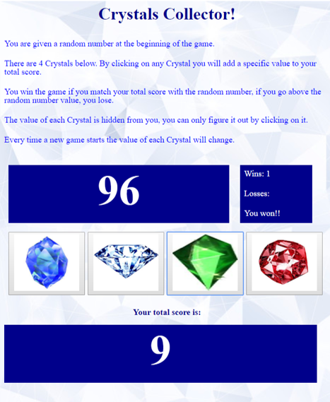

# CrystalsCollector Game
## Homework Week 04 - JQuery

This is the result of the assigned homework to reinforce the topic of JQuery.

It is about a game consisting of guessing a Random Number through the use of different crystals with different values each one. Interesting is that the user must pay attention to keep track of the value assigned to each crystal. The crystal values are reset every time the user ends any game either by winning or losing.

* The exercise includes :
    * use of Math.floor and Math.random functions
    * JQuery html to update html content
    * JQuery on click events

**Note**: If you use the developer inspect tools you can cheat your way out watching the values pinted on the console.

## Demo

